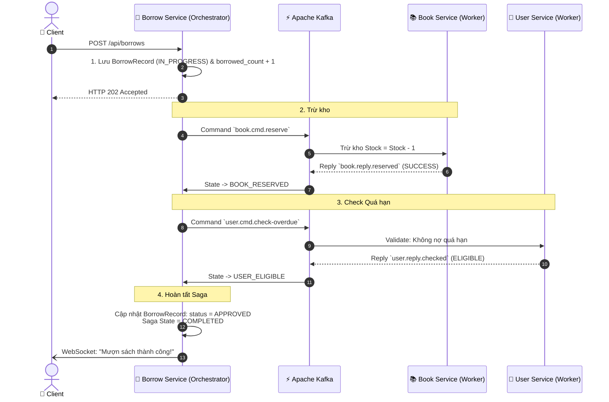

# Kiến Trúc Microservices: SAGA ORCHESTRATION PATTERN Với Apache Kafka

Tài liệu này chuẩn hóa toàn bộ thiết kế hệ thống theo mô hình **Saga Orchestration (Điều phối tập trung)** cho quy trình mượn sách.

---

## 1. Nguyên Lý Saga Orchestration (Bộ Điều Phối Trung Tâm)

Trong mô hình **Saga Orchestration**:
- **`Borrow-Service` đóng vai trò là SAGA ORCHESTRATOR**: Nắm giữ toàn bộ máy trạng thái (State Machine), logic quy trình nghiệp vụ và trực tiếp ra quyết định:
  - Khi nào gửi lệnh gì (**Command**).
  - Khi nhận kết quả (**Reply**) thì chuyển sang bước nào tiếp theo.
  - Khi có lỗi ở bất kỳ bước nào thì kích hoạt chuỗi bù trừ (**Compensating Transactions**) theo thứ tự ngược lại.
- **`Book-Service` & `User-Service` đóng vai trò là WORKER SERVICES**: 
  - Hoàn toàn độc lập, **không biết về sự tồn tại của nhau**.
  - Chỉ lắng nghe Command từ Orchestrator qua Kafka $\rightarrow$ Thực hiện Local Transaction trên Database riêng $\rightarrow$ Bắn Reply Event về lại cho Orchestrator.

```
                   ┌────────────────────────────────────────┐
                   │    BORROW SERVICE (Saga Orchestrator)  │
                   │    - Quản lý Saga State Machine        │
                   │    - Ghi nhận BorrowRecord             │
                   │    - Phát lệnh Command & Xử lý Reply  │
                   └───────┬────────────────────────▲───────┘
                           │ (Commands)             │ (Replies)
             ┌─────────────▼────────────────────────┴─────────────┐
             │                APACHE KAFKA BROKER                 │
             │  • book.cmd.reserve        • book.reply.reserve    │
             │  • book.cmd.compensate     • book.reply.compensate │
             │  • user.cmd.check-overdue  • user.reply.checked    │
             └─────────────┬────────────────────────▲─────────────┘
                           │                        │
             ┌─────────────▼────────┐      ┌────────┴─────────────┐
             │     BOOK SERVICE     │      │     USER SERVICE     │
             │   (Worker Inventory) │      │   (Worker Validator) │
             │   - Trừ kho (-1)     │      │   - Check quá hạn    │
             │   - Hoàn kho (+1)    │      │   - Trả kết quả      │
             │   [book_db]          │      │   [user_db]          │
             └──────────────────────┘      └──────────────────────┘
```

---

## 2. Lược Đồ Tuần Tự Saga Orchestration

### 2.1. Kịch Bản Bù Trừ Kép (Khi User Quá Hạn) ⭐

> **Mô tả:** Orchestrator tạo record $\rightarrow$ Orchestrator gửi lệnh trừ kho $\rightarrow$ Kho trừ thành công $\rightarrow$ Orchestrator gửi lệnh check quá hạn $\rightarrow$ User Service báo vi phạm $\rightarrow$ **Orchestrator kích hoạt bù trừ hoàn kho (+1) và hủy phiếu mượn.**

```mermaid
sequenceDiagram
    autonumber
    actor Client as 👤 Client (React App)
    participant Orch as 🧭 Borrow Service (Saga Orchestrator)
    participant Kafka as ⚡ Apache Kafka
    participant BookWorker as 📚 Book Service (Worker)
    participant UserWorker as 👤 User Service (Worker)

    Client->>Orch: POST /api/borrows (userId: 5, bookId: "B001")
    
    rect rgb(235, 245, 255)
        note over Orch: BƯỚC 1: ORCHESTRATOR LƯU STATE BAN ĐẦU
        Orch->>Orch: 1. Tạo Saga Instance (sagaId: UUID)<br/>2. Tạo BorrowRecord (status: IN_PROGRESS)<br/>3. Tăng user.borrowed_count + 1 (Commit DB Borrow)
        Orch-->>Client: HTTP 202 Accepted { sagaId, status: "IN_PROGRESS" }
    end

    rect rgb(235, 255, 240)
        note over Orch,BookWorker: BƯỚC 2: ORCHESTRATOR ĐIỀU PHỐI TRỪ KHO
        Orch->>Kafka: Publish Command: `book.cmd.reserve` (sagaId, bookId, qty: 1)
        Kafka->>BookWorker: Consume `book.cmd.reserve`
        BookWorker->>BookWorker: Local Tx: Stock = Stock - 1 (Commit DB Book)
        BookWorker-->>Kafka: Publish Reply: `book.reply.reserved` (status: SUCCESS)
        Kafka->>Orch: Consume Reply -> Cập nhật Saga State: BOOK_RESERVED
    end

    rect rgb(255, 240, 240)
        note over Orch,UserWorker: BƯỚC 3: ORCHESTRATOR ĐIỀU PHỐI CHECK QUÁ HẠN
        Orch->>Kafka: Publish Command: `user.cmd.check-overdue` (sagaId, userId: 5)
        Kafka->>UserWorker: Consume `user.cmd.check-overdue`
        UserWorker->>UserWorker: Kiểm tra DB: User đang nợ 1 sách quá hạn!
        UserWorker-->>Kafka: Publish Reply: `user.reply.checked` (isEligible: FALSE)
        Kafka->>Orch: Consume Reply -> Phát hiện FAIL ở Bước 3
    end

    rect rgb(65, 20, 25)
        note over Orch,BookWorker: BÙ TRỪ 1: ORCHESTRATOR PHÁT LỆNH HOÀN KHO
        Orch->>Orch: Đổi Saga State: COMPENSATING_BOOK
        Orch->>Kafka: Publish Command: `book.cmd.compensate` (sagaId, bookId, qty: 1)
        Kafka->>BookWorker: Consume `book.cmd.compensate`
        BookWorker->>BookWorker: Local Tx: Stock = Stock + 1 (Rollback DB Book)
        BookWorker-->>Kafka: Publish Reply: `book.reply.compensated` (status: SUCCESS)
        Kafka->>Orch: Consume Reply -> Hoàn kho hoàn tất
    end

    rect rgb(55, 25, 45)
        note over Orch: BÙ TRỪ 2: ORCHESTRATOR ROLLBACK PHIẾU MƯỢN
        Orch->>Orch: Cập nhật BorrowRecord: status = REJECTED_OVERDUE<br/>Giảm lại user.borrowed_count - 1<br/>Cập nhật Saga State: FAILED
    end

    Orch-)Client: Gửi WebSocket/SSE: "Mượn thất bại do tài khoản còn sách quá hạn (Đã hoàn kho & hủy phiếu)."
```



---

### 2.2. Kịch Bản Thành Công (Happy Path)



---

## 3. Thiết Kế Kafka Topics (Command - Reply Channel)

Mô hình Orchestration sử dụng quy chuẩn đặt tên Topic rõ ràng:

| Kênh Topic | Loại | Producer | Consumer | Payload chính |
| :--- | :---: | :--- | :--- | :--- |
| `book.cmd.reserve` | **Command** | `Borrow-Orchestrator` | `Book-Service` | `{ sagaId, bookId, quantity: 1 }` |
| `book.reply.reserved` | **Reply** | `Book-Service` | `Borrow-Orchestrator` | `{ sagaId, isSuccess, reason }` |
| `user.cmd.check-overdue` | **Command** | `Borrow-Orchestrator` | `User-Service` | `{ sagaId, userId }` |
| `user.reply.checked` | **Reply** | `User-Service` | `Borrow-Orchestrator` | `{ sagaId, isEligible, reason }` |
| `book.cmd.compensate` | **Command** | `Borrow-Orchestrator` | `Book-Service` | `{ sagaId, bookId, quantity: 1 }` |
| `book.reply.compensated` | **Reply** | `Book-Service` | `Borrow-Orchestrator` | `{ sagaId, isSuccess }` |

---

## 4. Code Triển Khai Hoàn Chỉnh (Spring Boot + Spring Kafka)

### 4.1. `BorrowSagaOrchestrator.java` (Tại `Borrow-Service`)

```java
package com.library.borrow.saga;

import com.library.borrow.dto.*;
import com.library.borrow.entity.BorrowRecord;
import com.library.borrow.entity.BorrowStatus;
import com.library.borrow.repository.BorrowRecordRepository;
import org.springframework.beans.factory.annotation.Autowired;
import org.springframework.kafka.annotation.KafkaListener;
import org.springframework.kafka.core.KafkaTemplate;
import org.springframework.stereotype.Service;
import org.springframework.transaction.annotation.Transactional;
import java.util.UUID;

@Service
public class BorrowSagaOrchestrator {

    @Autowired
    private BorrowRecordRepository borrowRepository;

    @Autowired
    private KafkaTemplate<String, Object> kafkaTemplate;

    // ==========================================
    // BƯỚC 1: KHỞI TẠO SAGA & GỬI LỆNH TRỪ KHO
    // ==========================================
    @Transactional
    public BorrowRecord initiateBorrowSaga(BorrowRequestDTO request) {
        String sagaId = UUID.randomUUID().toString();

        BorrowRecord record = new BorrowRecord();
        record.setSagaId(sagaId);
        record.setUserId(request.getUserId());
        record.setBookId(request.getBookId());
        record.setDueDate(request.getDueDate());
        record.setStatus(BorrowStatus.IN_PROGRESS);
        borrowRepository.save(record);

        // Orchestrator phát Command 1: Trừ kho sách
        ReserveBookCommand cmd = new ReserveBookCommand(sagaId, request.getBookId(), 1);
        kafkaTemplate.send("book.cmd.reserve", sagaId, cmd);

        return record;
    }

    // ==========================================
    // BƯỚC 2: NHẬN PHẢN HỒI TỪ BOOK SERVICE
    // ==========================================
    @KafkaListener(topics = "book.reply.reserved", groupId = "borrow-orchestrator-group")
    public void onBookReservedReply(BookReservedReply reply) {
        BorrowRecord record = borrowRepository.findBySagaId(reply.getSagaId())
                .orElseThrow(() -> new RuntimeException("Saga record not found: " + reply.getSagaId()));

        if (reply.isSuccess()) {
            record.setStatus(BorrowStatus.BOOK_RESERVED);
            borrowRepository.save(record);

            // Orchestrator phát Command 2: Kiểm tra sách quá hạn
            CheckUserOverdueCommand cmd = new CheckUserOverdueCommand(reply.getSagaId(), record.getUserId());
            kafkaTemplate.send("user.cmd.check-overdue", reply.getSagaId(), cmd);
        } else {
            // Thất bại do hết kho -> Rollback record mượn
            record.setStatus(BorrowStatus.REJECTED_OUT_OF_STOCK);
            record.setRejectReason(reply.getReason());
            borrowRepository.save(record);
        }
    }

    // ==========================================
    // BƯỚC 3: NHẬN PHẢN HỒI TỪ USER SERVICE
    // ==========================================
    @KafkaListener(topics = "user.reply.checked", groupId = "borrow-orchestrator-group")
    public void onUserCheckedReply(UserCheckedReply reply) {
        BorrowRecord record = borrowRepository.findBySagaId(reply.getSagaId())
                .orElseThrow(() -> new RuntimeException("Saga record not found: " + reply.getSagaId()));

        if (reply.isEligible()) {
            // Thành công toàn bộ chuỗi Saga
            record.setStatus(BorrowStatus.APPROVED);
            borrowRepository.save(record);
        } else {
            // USER CÓ SÁCH QUÁ HẠN -> KÍCH HOẠT BÙ TRỪ KHO!
            record.setStatus(BorrowStatus.COMPENSATING);
            record.setRejectReason(reply.getReason());
            borrowRepository.save(record);

            // Orchestrator phát Command Bù Trừ: Hoàn trả lại kho (+1)
            CompensateBookCommand compensateCmd = new CompensateBookCommand(
                record.getSagaId(), record.getBookId(), 1, "USER_OVERDUE_REJECTED"
            );
            kafkaTemplate.send("book.cmd.compensate", record.getSagaId(), compensateCmd);
        }
    }

    // ==========================================
    // BƯỚC 4: NHẬN XÁC NHẬN BÙ TRỪ TỪ BOOK SERVICE
    // ==========================================
    @KafkaListener(topics = "book.reply.compensated", groupId = "borrow-orchestrator-group")
    public void onBookCompensatedReply(BookCompensatedReply reply) {
        BorrowRecord record = borrowRepository.findBySagaId(reply.getSagaId())
                .orElseThrow(() -> new RuntimeException("Saga record not found: " + reply.getSagaId()));

        // Chốt trạng thái Rollback hoàn tất
        record.setStatus(BorrowStatus.REJECTED_OVERDUE);
        borrowRepository.save(record);
    }
}
```

---

### 4.2. `BookWorkerListener.java` (Tại `Book-Service`)

```java
package com.library.book.saga;

import com.library.book.dto.*;
import com.library.book.entity.Book;
import com.library.book.repository.BookRepository;
import org.springframework.beans.factory.annotation.Autowired;
import org.springframework.kafka.annotation.KafkaListener;
import org.springframework.kafka.core.KafkaTemplate;
import org.springframework.stereotype.Service;
import org.springframework.transaction.annotation.Transactional;

@Service
public class BookWorkerListener {

    @Autowired private BookRepository bookRepository;
    @Autowired private KafkaTemplate<String, Object> kafkaTemplate;

    // Nhận Command Trừ Kho
    @Transactional
    @KafkaListener(topics = "book.cmd.reserve", groupId = "book-worker-group")
    public void handleReserveCommand(ReserveBookCommand cmd) {
        Book book = bookRepository.findById(cmd.getBookId()).orElse(null);
        BookReservedReply reply = new BookReservedReply();
        reply.setSagaId(cmd.getSagaId());

        if (book != null && book.getQuantity() >= cmd.getQuantity()) {
            book.setQuantity(book.getQuantity() - cmd.getQuantity());
            bookRepository.save(book);
            reply.setSuccess(true);
        } else {
            reply.setSuccess(false);
            reply.setReason("Hết sách trong kho hoặc không tìm thấy sách");
        }
        kafkaTemplate.send("book.reply.reserved", cmd.getSagaId(), reply);
    }

    // Nhận Command Bù Trừ (Hoàn Kho)
    @Transactional
    @KafkaListener(topics = "book.cmd.compensate", groupId = "book-worker-group")
    public void handleCompensateCommand(CompensateBookCommand cmd) {
        Book book = bookRepository.findById(cmd.getBookId()).orElse(null);
        if (book != null) {
            book.setQuantity(book.getQuantity() + cmd.getQuantity()); // Hoàn lại +1
            bookRepository.save(book);
        }

        BookCompensatedReply reply = new BookCompensatedReply(cmd.getSagaId(), true);
        kafkaTemplate.send("book.reply.compensated", cmd.getSagaId(), reply);
    }
}
```

---

### 4.3. `UserWorkerListener.java` (Tại `User-Service`)

```java
package com.library.user.saga;

import com.library.user.dto.*;
import com.library.user.repository.BorrowHistoryRepository;
import org.springframework.beans.factory.annotation.Autowired;
import org.springframework.kafka.annotation.KafkaListener;
import org.springframework.kafka.core.KafkaTemplate;
import org.springframework.stereotype.Service;
import java.time.LocalDate;

@Service
public class UserWorkerListener {

    @Autowired private BorrowHistoryRepository historyRepository;
    @Autowired private KafkaTemplate<String, Object> kafkaTemplate;

    // Nhận Command Kiểm Tra Quá Hạn
    @KafkaListener(topics = "user.cmd.check-overdue", groupId = "user-worker-group")
    public void handleCheckOverdueCommand(CheckUserOverdueCommand cmd) {
        // Kiểm tra xem User có sách nào bị quá hạn chưa trả không
        boolean hasOverdue = historyRepository.existsByUserIdAndDueDateBeforeAndReturnDateIsNull(
                cmd.getUserId(), LocalDate.now()
        );

        UserCheckedReply reply = new UserCheckedReply();
        reply.setSagaId(cmd.getSagaId());
        reply.setUserId(cmd.getUserId());

        if (hasOverdue) {
            reply.setEligible(false);
            reply.setReason("Người dùng đang có sách quá hạn chưa hoàn trả");
        } else {
            reply.setEligible(true);
        }

        kafkaTemplate.send("user.reply.checked", cmd.getSagaId(), reply);
    }
}
```
